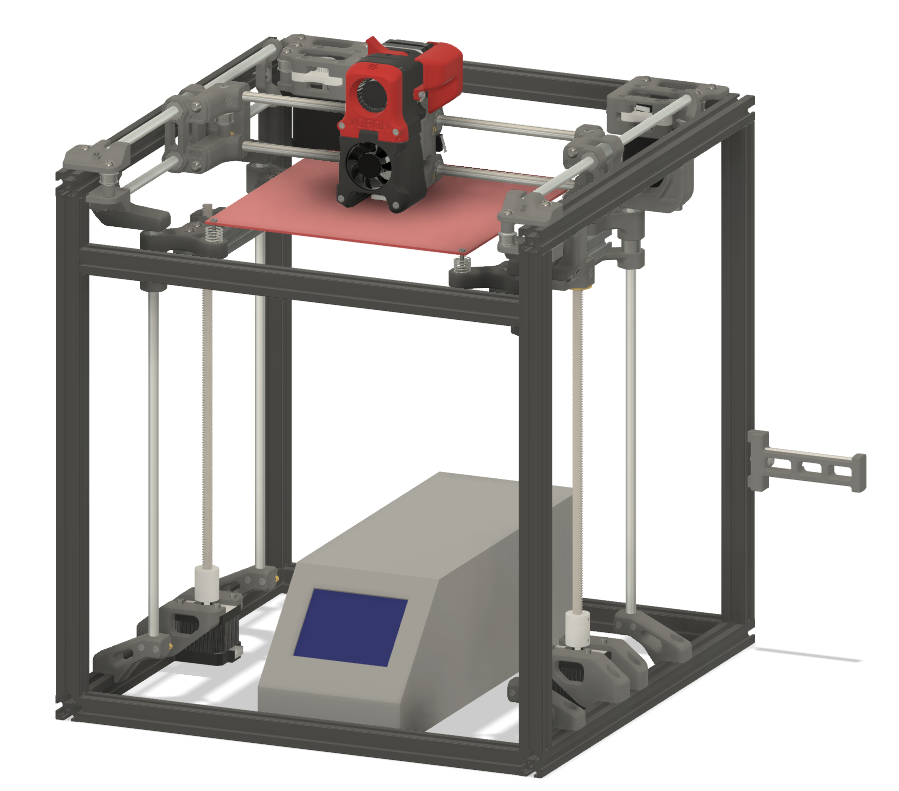

# VORON Legacy Duplicator i3

This project is still a work in progress and has not actually been physically made, please use any information found here at your own discretion.

The plan for this project is to upcycle my Monoprice Maker Select 3D into a Voron Legacy, but should work for any Wanhao Duplicator i3 clones. The "plus" models will have additonal work for electronics but is out of scope since I do not have that model. Below are the goals this project is working towards or the "mission statement":

- [ ] Reuse the bed from the i3
    - Requires 2 modified 3D printed parts (Qty 2 of each)
        - Z Bearing Retainer A Upper
        - Z Bearing Retainer B Upper
- [ ] Forward compatible with future Legacy updates from Voron
    - I don't want to fork this into a new printer entirely, at it's core it should still be a Voron Legacy
- [ ] Requirement minimal to no rewiring, the wire loop will probably need to be removed/cut but the electronics in theory shouldn't need to be touched

# Configurator

1. Go to the [Legacy webpage](https://vorondesign.com/voron_legacy)
2. Click on "Configurator"
3. Choose "New Build. Give me the full BOM."
4. Choose "Blind Joints"
5. Choose "Custom Size"
6. Enter Frame Dimensions as follows:
    - Width: 410
    - Depth: 410
    - Height: 440
7. Click "Download" and save csv BOM
8. Click "Show" to see full BOM in browser

# Updated BOM

| Category      | Part Description                              | Qty                        | Notes                         |
| ------------- | --------------------------------------------- | -------------------------- |------------------------------ |
| Motion        | <strike>TR8x8 Leadscrew Nut</strike>          | <strike>2</strike> 0       |                               |
| Motion        | Linear Shaft 8x350mm Shaft                    | 4                          |                               |
| Motion        | Linear Shaft 8x320mm Shaft                    | <strike>6</strike> 2       |                               |
| Motion        | LM8LUU Linear Bearing                         | 10*                        |                               |
| Motion        | GT2 Open Belt LL-2GT-6 (6mm wide) - 1690mm    | 2                          |                               |
| Motion        | <strike>GT2 20T Pulley (5mm bore)</strike>    | <strike>2</strike> 0       |                               |
| Motion        | F695 Bearing                                  | 24                         |                               |
| Frame         | <strike>2020 T-Slot Extusion - 440mm</strike> | <strike>4</strike> 0**     | Replaced with next line       |
| Frame         | 2020 T-Slot Extusion - 410mm                  | 4**                        |                               |
| Frame         | 2020 T-Slot Extusion - 370mm                  | <strike>8</strike> 4**     | Qty 4 Replaced with next line |
| Frame         | 2020 T-Slot Extusion - 400mm                  | 4**                        |                               |
| Frame         | <strike>2020 T-Slot Extusion - 130mm</strike> | <strike>2</strike> 0       | Replaced with next line       |
| Frame         | 2020 T-Slot Extusion - 190mm                  | 2                          |                               |
| Frame         | 2020 Corner Brackets (MiSUMi HBLFSNB5)        | 24***                      |                               |
| Fasteners     | M5x40 SHCS                                    | 6                          |                               |
| Fasteners     | M5x30 BHCS                                    | 12                         |                               |
| Fasteners     | M5x16 BHCS                                    | <strike>41</strike> 89**** |                               |
| Fasteners     | M5x10 BHCS                                    | 26                         |                               |
| Fasteners     | M5 Washer                                     | 24                         |                               |
| Fasteners     | M5 T-Nut                                      | <strike>51</strike> 99**** |                               |
| Fasteners     | M5 Hexnut                                     | 4                          |                               |
| Fasteners     | M4x8 BHCS                                     | 5                          |                               |
| Fasteners     | M3x8 SHCS                                     | 20                         |                               |
| Fasteners     | M3x40 SHCS                                    | 5                          |                               |
| Fasteners     | M3x30 SHCS                                    | 20                         |                               |
| Fasteners     | M3x20 SHCS                                    | 8                          |                               |
| Fasteners     | M3x16 SHCS                                    | 16                         |                               |
| Fasteners     | M3x12 SHCS                                    | 8                          |                               |
| Fasteners     | M3 Threaded Insert                            | 43                         |                               |
| Fasteners     | M2x10 Self-Tapping Screw                      | 8                          |                               |
| Fasteners     | <strike>Bed Spring 1" L 0.408" OD</strike>    | <strike>4</strike> 0       |                               | 

&ast;Possible to reuse 5 linear bearings from i3, if they can be removed from the bearing block.

&ast;&ast;Not strictly required, but I think the assembly is easier with these modified lengths.

&ast;&ast;&ast;I don't know why these aren't on the original BOM, I think this is an error in the Configurator. If not using Corner blocks these are required for Legacy builds.

&ast;&ast;&ast;&ast;I haven't looked to see where all of these are used, but I assume more will be required for the added corner brackets (2 per bracket).

Other than the above categories, the rest of the BOM categories should be safe to ignore.

- I will update this section once I get to the extruder portion of this project.
- I'm making a fairly big assumption that the existing harness will reach everywhere it needs to, this might prove to be an error. Stay tuned.

# Printed Parts

With 3 exceptions, all printed parts can be sourced from [Voron directly](https://github.com/VoronDesign/Voron-Legacy/releases/tag/V1.0). This repo was forked from the original Voron Legacy repo at release v1.0 and all STLs are still present in this repo for completeness, but it is best practice to get the latest files directly from Voron.

- The Z Bearing Retainer A Upper and Z Bearing Retainer B Upper needed to be modified to move the bed mounting hole 3mm away from the bearing hole in the X direction.
- The install location of the "Z Shaft Support - Lower" also needs to be moved which required a redesign of the "Z Alignment Jig".

These modified STLs are available in the STLs/i3 folder of this repo.

# CAD

The Voron Legacy Fusion 360 model was used to generate the modified STLs. This modified model is available along with the original in the CAD folder of this repo as well as a .STEP export or each.

# Firmware

The firmware of choice for Vorons is Klipper, which works on the stock Melzi board as well as pretty much anything else that can run an FDM printer. My i3 has an SKR-Mini E3 v2.0, so when I get that far there will be a "skr-mini_e3_v2.0_config.cfg" file in the Firmware folder of this repo. 

Please note that I've left the default "skr_v1.3_config.cfg" file in this repo for now as reference, but it has not been reconfigured for the "Legacy Reduplicator i3" print volume or internals.

# VORON Legacy Source Info

This repo was forked on Jan 18, 2022 and may be out of date from the original. Please see the official release of the Voron Legacy 3d printer at the [Voron Design]( http://vorondesign.com/voron_legacy) website.

